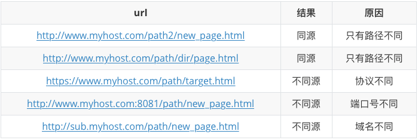
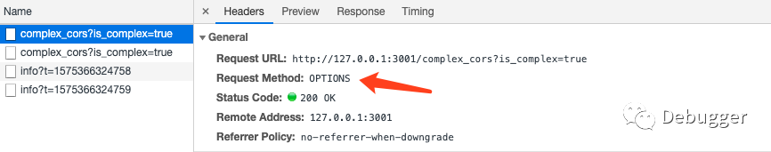
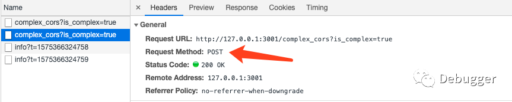
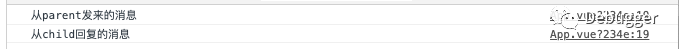
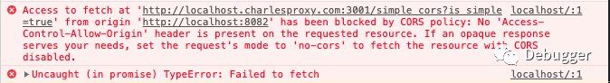
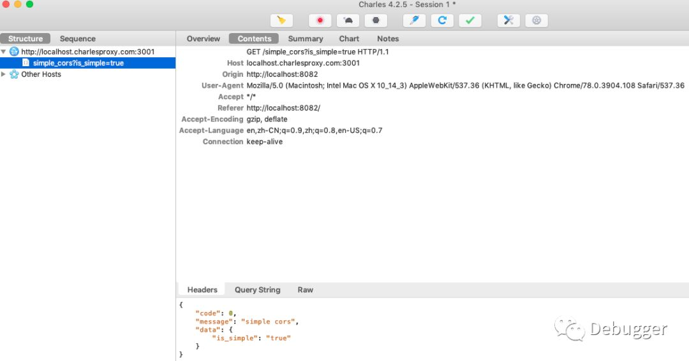
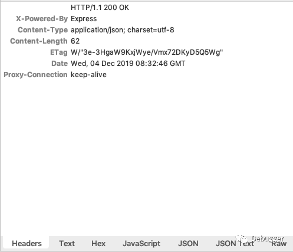
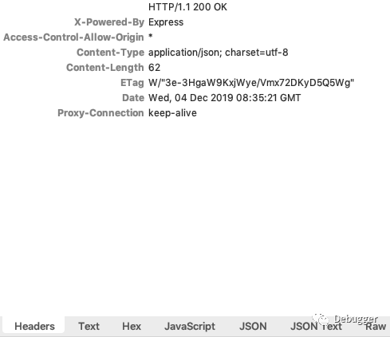

从15年开始工作用jQuery，到后来Vue全家桶一把梭，好像很少实实在在地碰到跨域的问题，毕竟在jQuery里可以用jsonp，基于Vue的项目有webpack-dev-serve，就算上线了，后端的同事帮我们配置一下就搞定了。而为什么有跨域？跨域只存在于浏览器吗？怎么解决跨域？在浏览器里，发一个跨域请求的时候浏览器真的发了请求吗？

带着这几个问题，我决定把跨域这块的内容给整理一下。

# 为什么会有跨域？

要回答这个问题，其实应该先回答另一个问题：跨域只存在于浏览器吗？


是的，对于服务器之间来说并没有跨域一说（但并不是说服务端就不会做鉴权了）。只不过浏览器是面向各种格言的C端用户的使用门槛太低，黑客也可以直接通过浏览器做很多操作达到很多目的，所以提出了一个大家很熟悉的概念 -- 同源策略。

那为什么会要搞一个同源策略，为什么又要跨域请求呢？

## 同源策略

在MDN上，对“源”给出了很明确的定义：

*如果两个页面的协议，端口（如果有指定）和域名都相同，则两个页面具有相同的源。*

因此，对于http://www.myhost.com/path/target.html这样一个url来说，以下给出了一些url，并且它们和上面这个url是否同源做出了检测：



对应到我们平时的开发中就是，如果请求路径和当前站点的协议、端口号、域名有任意一项不同，那么这个请求是会失败的。

那么问题来了，如果没有同源策略会发生什么呢？我们可以看两个很简单的例子。

### 没有同源策略限制的接口请求

首先，在登录的场景下，我们经常会使用cookie来记录用户信息。在一次登录成功之后，服务端会通过set-cookie返回头写入cookie信息，下次打开页面的时候会自动带上cookie，那么这时打开的就是有登录状态的页面了。

如果在某次登录银行的页面之后，用户打开了另一个不可描述的站点，正在看的过程中，这个站点的一些隐藏代码向用户登录过的银行发起了请求，可是由于没有同源策略的保护，这个请求带上了银行的cookie，如果运气好cookie还没有过期的话，那么服务端就认为这是前端发来的正确请求，那自己的账户就完全暴露了。

### 没有同源策略限制的DOM操作

有一天用户突然收到了一封邮件，说用户的银行账户有问风险，要用户点击链接登录，结果用户没看清url地址，真实的url是www.yinhang.com，而用户打开的却是www.yinghang.com。但是后者打开之后显示的和真实的站点是一样的，因为后者直接套用iframe打开的真实的站点。在用户输入用户名和密码之后，如果没有同源策略限制DOM操作，那么钓鱼网站就可以通过以下代码获取用户信息：

```javascript
// HTML
<iframe name="yinhang" src="www.yinhang.com"></iframe>
// JS
// 由于没有同源策略的限制，钓鱼网站可以直接拿到别的网站的Dom
const iframe = window.frames['yinhang']
const node = iframe.document.getElementById('你输入账号密码的Input')
console.log(`拿到了这个${node}，我还拿不到你刚刚输入的账号密码吗`)
```

上面两个小例子是最简单的两种因为没有同源策略导致的问题，当然不是有了同源策略我们就可以高枕无忧了，只不过同源策略会相对提高站点被黑的门槛。

## 解决接口跨域的N种方法

为了演示下面的demo，我初始化了两个项目，一个是Express脚手架起的项目，地址是http://localhost:3001，另一个是Vue脚手架起的项目，地址是http://localhost:8080。

### JSONP

从jQuery时代过来的前端工程师应该是很熟悉JSONP了，其原理就是利用浏览器对于script、img标签在跨域上的“特殊处理”，它们并没有跨域限制，因此我们可以利用这一点达到跨域的目的。

后端代码：

```javascript
// jsonp demo
router.get('/jsonp', function (req, res) {
  const result = {
    code: 0,
    message: 'jsonp success'
  }
​
  // cb是前端传来的query参数
  res.send(`${req.query.cb}(${JSON.stringify(result)})`)
})
```

前端代码：

```html
<script type="text/javascript">
    window.jsonpCallback = function (res) {
      console.log('res', res)
    }
</script>
<script src="http://localhost:3001/jsonp?cb=jsonpCallback"></script>
```

当然，如果跨域接口过多的话，可以稍微封装一下这个过程：

```javascript
function requestJSONP (url, data, jsonp = 'jsonpCallback') {
  return new Promise((resolve, reject) => {
    let arr = []
    
    Object.keys(data).forEach(key => {
      arr.push(`${key}=${data[key]}`)
    })
    
    let query = arr.join('&')
    const script = document.createElement('script')
    
    window[jsonp] = function (response) {
      document.body.removeChild(script)
      delete window[jsonp]
      resolve(response)      
    }
    
    script.src = `${url}?${query}&cb=${jsonp}`
    document.body.appendChild(script)
  })
}
​
// 业务代码中
requestJSONP('http://localhost:3001/jsonp', {
  data: 'Hello World'
}, 'testJSONP').then(response => {
  console.log('JSONP', response)
})
```

### iframe + form

很容易发现，JSONP只能处理GET请求，好在我们可以用iframe + form来处理POST请求。我们使用iframe发送数据，使用form执行表单提交：

```javascript
function requestPOST (url, data, cb) {
  const iframe = document.createElement('iframe')
    
  iframe.name = 'iframePost'
  iframe.style.display = 'none'
  document.body.appendChild(iframe)
    
  const form = document.createElement('form')
  // input用来存放post提交的数据
​  const input = document.createElement('input')
    
  iframe.addEventListener('load', function () {
    if (cb && typeof cb == 'function') {
      cb()
    }
  })
  
  form.action = url
  form.target = iframe.name
  form.method = 'post'
   
  Object.keys(data).forEach(key => {
    input.name = key
    input.value = data[key].toString()
    form.appendChild(input.cloneNode())
  })
  
  form.style.display = 'none'
  document.body.appendChild(form)
  form.submit()
  
  document.body.removeChild(form)
}
​
// 业务场景调用
requestPOST('http://localhost:3001/iframe_form', {
  data: 'Hello World'
}, function (response) {
  console.log('response', response)
})
```

### CORS

CORS的全称是**Cross-Origin Resource Sharing(跨域资源共享)**，是处理跨域问题的标准做法。CORS的请求分为简单请求和非简单请求。

只要同时满足以下两大条件，就属于简单请求：

- 请求方法是以下三种之一
  - HEAD
  - GET
  - POST
- HTTP的头信息不超出以下几种字段
  - Accept
  - Accept-Language
  - Content-Language
  - Last-Event-ID
  - Content-Type：只限application/x-www-form-urlencoded、multipart/form-data、text/plain

来个demo：

```javascript
// 后端接口
// simple cors demo
router.get('/simple_cors', function (req, res) {
  const result = {
    code: 0,
    message: 'simple cors',
    data: req.query
  }
​
  res.header('Access-Control-Allow-Origin', '*')
  res.send(result)
})
```

前端正常请求即可：

```javascript
fetch('http://127.0.0.1:3001/simple_cors?is_simple=true').then(response => {
  console.log('simple cors', response)
})
```

而非简单请求会先发一个**预检测请求（preflight）**，只有当预检测请求通过之后，才会发出真正的请求。

服务端代码：

```javascript
// 处理options请求
router.options('*', function (req, res, next) {
  res.header('Access-Control-Allow-Origin', 'http://127.0.0.1:8080')
​  res.header('Access-Control-Allow-Credentials', true)
  res.header('Access-Control-Request-Method', 'PUT,POST,GET,DELETE,OPTIONS')
  res.header('Access-Control-Allow-Headers', 'Origin, X-Requested-With, Content-Type, Accept, token')
​
  next()
})
​
// 复杂跨域接口
router.post('/complex_cors', function (req, res) {
  const result = {
    code: 0,
    message: 'complex cors',
    data: req.query
  }
​
  res.header('Access-Control-Allow-Origin', 'http://127.0.0.1:8080')
  res.header('Access-Control-Allow-Credentials', true)
  res.header('Access-Control-Request-Method', 'PUT,POST,GET,DELETE,OPTIONS')
  // 随便写了个cookie，浏览器里可能会报错，可以忽略，仅供演示
  res.cookie('a', 1)
​
  res.send(result)
})
```

前端请求也很容易：

```javascript
fetch('http://127.0.0.1:3001/complex_cors?is_complex=true', {
  method: 'POST',
  credentials: 'include',
  headers: { 'token': 'extra headers' }
}).then(response => {
  return response.json()
}).catch(err => {
  console.log('complex err', err)
}).then(response => {
  console.log(response)
})
```

此时我们在控制台可以看到两个请求：





当然，对于Express或者Koa这类基于NodeJS的服务端框架，有很多开源的中间件来处理跨域问题，就不需要每次都手写这么多代码了。

### 代理

而在前端工程化日益重要的今天，我们可以使用代理来处理跨域。例如webpack-dev-serve和Nginx。

webpack-dev-serve的原理主要也是服务器之间的请求是没有跨域的，它会用express起一个服务，然后将所有请求透传到指定的URI。不过这是开发环境下的方法，一旦放到线上，这个方法就不行了，这个时候我们可以使用Nginx来做转发。

众所周知，Nginx是做反向代理的绝佳武器，当然，用来做接口转发也是小菜一碟了：

```nginx
server {
  listen      80;
  server_name     www.myhost.com;
  location ^~ /api   {
      proxy_pass  http://127.0.0.1:3001;
  }
}
```

## 解决同源策略下DOM查询的方法

### postMessage

window.postMessage是HTML5提供的API，可以实现安全地跨源通信。假设有两个不同源的页面：http://localhost:8080和http://localhost:8081，且前者是父页面，后者是子页面，可以通过一个demo来看一下（两个域名对应的项目都是Vue脚手架起的）。

父页面：

```html
<template>
  <div id="app">
    <button type="button" @click.stop="getMessage">测试按钮</button>
    <iframe name="child" src="http://localhost:8081" width="800" height="600"></iframe>
  </div>
</template>
​
<script>
export default {
  name: 'app',
  methods: {
    getMessage () {
      window.frames.child.postMessage('从parent发来的消息', 'http://localhost:8081')
    }
  },
  mounted () {
    window.addEventListener('message', e => {
      if (e.origin === 'http://localhost:8081') {
        console.log(e.data)
      }
    })
  }
}
</script>
```

子页面：

```html
<template>
  <div id="app">
    我是子页面
  </div>
</template>
​
<script>
export default {
  name: 'app',
  mounted () {
    window.addEventListener('message', e => {
      if (e.origin === 'http://localhost:8080') {
        console.log(e.data)
        e.source.postMessage('从child回复的消息', 'http://localhost:8080')
      }
    })
  }
}
</script>
```

最终，在点击父页面上的测试按钮之后，可以在控制台看到如下内容：



### document.domain

这种方式适合子域名不同的iframe跨域，就不做demo了

### canvas处理跨域

张鑫旭大佬还写过用canvas处理跨域：https://www.zhangxinxu.com/wordpress/2018/02/crossorigin-canvas-getimagedata-cors/

到这就写完了如何处理跨域的各种方法了，但是还剩下最开始的最后一个问题，那就是在浏览器报跨域的问题时，到底浏览器有没有发请求呢？

# 浏览器处理跨域请求

答案是：发了。怎么证明呢？用抓包工具看一下就好了。

我们用之前的demo来发请求，用charles来抓包，前端发请求时，域名不能再用http://127.0.0.1，而需要使用charles能抓到的域名：http://localhost.charlesproxy.com，端口还是之前的3001，后端把CORS关掉。此时在浏览器控制台中能看到如下报错：



然后再看下charles的抓包情况：



可以看到，charles不仅抓到了一个请求，甚至连返回内容都有了。再看看开启CORS前后的返回头的区别。

开启前：



开启后：



很明显，开启CORS之后response headers会多一个Access-Control-Allow-Origin的字段用于标识这个请求是可以跨域共享资源的。

那么就清楚了，同源策略的确是在浏览器中才有的，对于普通的网络请求，浏览器会先发请求，待收到请求的返回之后，校验请求的response headers，再根据同源策略和response headers的内容判断能不能允许请求正常返回给js代码。

所以对于跨域这个问题来说，我们需要理解的是：

- 为什么有跨域以及出现的场景？
- 同源策略
- 解决跨域的方法及原理
- 对于一个跨域的请求，浏览器到底会不会发送请求？

参考资料：

- https://segmentfault.com/a/1190000015597029
- https://blog.csdn.net/wonking666/article/details/79159180
- MDN的各种相关文档
