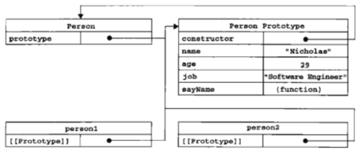
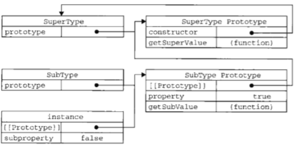
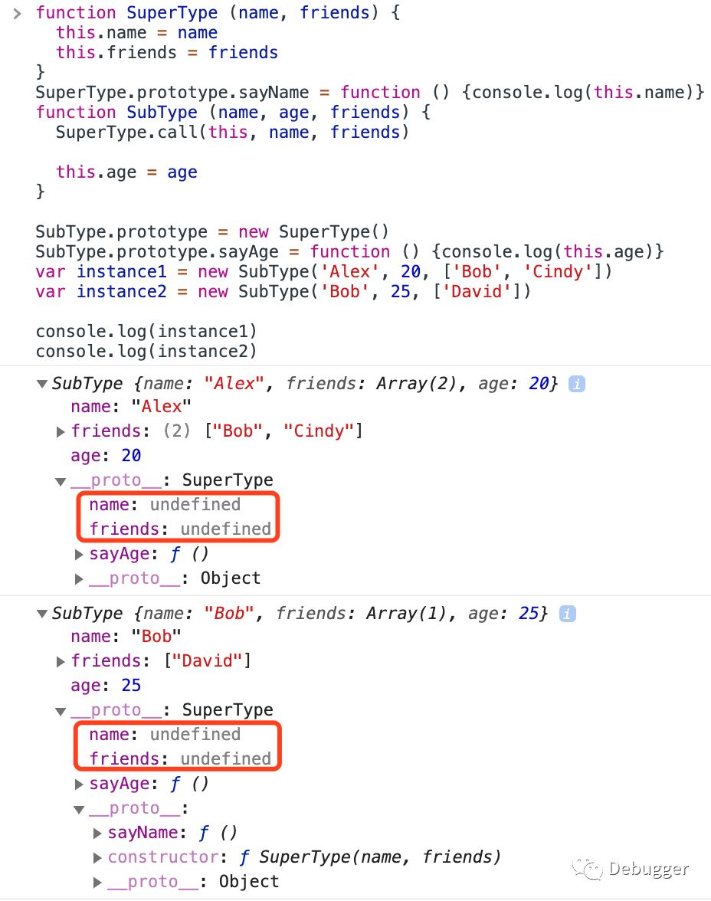
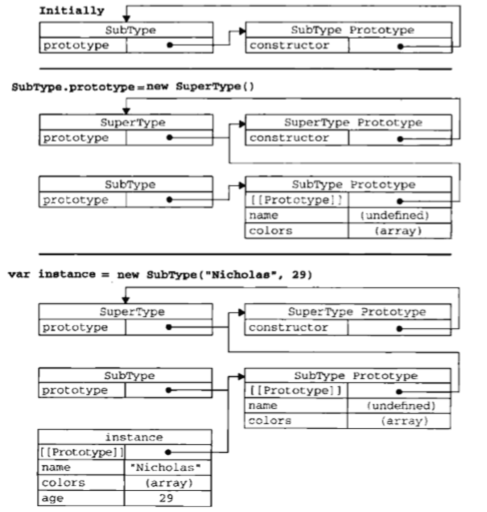

​在现在的业务开发中，应该很少人在写原生JavaScript了，大家都一股脑地扑在各个框架上。本来，这些框架对于业务和开发者来说是一种福音，减少了各种各样的开发痛点，但是带来的负面问题就是对于开发者来说，越来越依赖框架，离原生JavaScript越来越远，对基础知识的记忆和理解慢慢地模糊、淡忘。

而原型、原型链就是其中之一。

更令人感到煎熬的是，平时开发已经几乎用不到了，但是面试中几乎每个面试官都会问到。结果便是在面试之前临时抱佛脚地看一看书或者是网上找几篇文章复习一下，但是由于平时用得太少了，这样的复习也只是蜻蜓点水，面试官稍微多问几句就背不住了。

基于上述原因，加上对象、原型、原型链本身在JavaScript中就有一些让人比较难理解的点，今天我们来看看这些内容的迷惑行为。

# 对象

要说原型和原型链，就得先说说对象。ECMA-262把对象定义成“无序属性的集合，其属性可以包含基本值、对象或者函数”，我们可以很容易把对象理解成散列表，其实就是一组键值对，键是字符串或Symbol，值是数据或者函数。

而对象有如下特点：

- 唯一标识性：内容相同也不是同一个对象
- 有状态：同一个对象不同时刻可能有不同的内容
- 有行为：对象的状态，可能因为行为而变迁

唯一标识性很好理解，大家都知道在JavaScript中，辨认两个引用类型是否相同是看它们的内存地址是否相同，因此任意声明两个内容相同的变量，它们的内存地址肯定是不同的。

而状态和行为，在JavaScript中，都被称为属性。因为对象具有高度的动态性，我们在任何时候都能改变属性的值，同时，我们可以在对象的函数属性中修改对象的值属性或者是在声明对象之后再增加属性：

```javascript
var obj = {
  a: 1,
  b () {
    this.a = 2
  }
}
obj.b() // obj.a的值被改成2
​
obj.c = 3
console.log(obj.c) // 3
```

之前说到，我们可以把JavaScript对象的内容理解成简单的键值对，但是当JavaScript引擎处理对象的时候却不是这么的简单，相信大家都知道对象有两种属性：数据属性和访问器属性。

## 数据属性

数据属性有四种特性：

- [[configurable]]：能否配置当前属性，包括能否用delete删除、能否修改属性的特性、能否改成访问器属性等
- [[enumerable]]：能否通过for-in遍历当前属性
- [[writable]]：能否修改当前属性的值
- [[value]]：保存当前属性的值


在初始化一个对象时，前三个特性的值，默认为true。

## 访问器属性

访问器属性也有四种特性：

- [[configurable]]：同数据属性的configurable，默认为true
- [[enumerable]]：同数据属性的enumerable，默认为true
- [[getter]]：函数或undefined，取对象的属性的值时调用
- [[setter]]：函数或undefined，设置对象的属性的值时调用

我们可以通过Object.getOwnPropertyDescriptor(o)或Object.getOwnPropertyDescriptors(o, key)获取对象的属性描述。当我们用字面量声明一个对象时，默认地使用的是数据属性。同时，也可以通过访问器属性声明变量：

```javascript
var o = {
  get a () {
    return 1
  }
}
​
o.a // 1
```

可以看到，无论用哪种方式声明变量，其结果都是一样的。因此在JavaScript运行时，对象可以看做是属性的集合。

而在其它语言中，是用“类”的方式来描述对象的。可是JavaScript中却并没有“类”的概念，即便ES6提供了class关键字来声明类，但其实也只是语法糖罢了。

在前人的探索下，JavaScript基于自己的动态对象系统模型，设计了自己的原型系统用来模拟类的行为。

# 创建对象

在平时的开发中，最常见的创建对象的方式就是使用对象字面量，但是这就带来了一个问题，如果要创建重复的、相同内容的对象，就需要在多个地方写重复的、内容相同的代码，这会使得代码难以维护。
在JavaScript中，有以下几种常见的创建对象的方式

## 工厂函数模式

所谓工厂函数，"就是指这些内建函数都是类对象，当你调用他们时，实际上是创建了一个类实例"，但是JavaScript中没有真正的类，但是可以用对象代替：

```javascript
function createPerson (name, age, job) {
  var o = new Object()
  
  o.name = name
  o.age = age
  o.job = job
  o.sayName = function () {
    console.log(this.name)
  }
}
​
var person1 = createPerson('Alex', 20, 'Programmer')
var person2 = createPerson('Bob', 25, 'Product Manager')
```

我们可以多次调用这个函数，每次返回的都是不一样的对象，但是，这个方法却无法解决对象识别的问题，即怎样知道一个对象的类型。

## 构造函数模式

这个模式也熟为人知：

```javascript
function Person (name, age, job) {
  this.name = name
  this.age = age
  this.job = job
  this.sayName = function () {
    console.log(this.name)
  }
}
​
var person1 = new Person('Alex', 20, 'Programmer')
var person2 = new Person('Bob', 25, 'Product Manager')
```

这里就涉及到了new操作符的执行过程：

- 创建一个新对象
- 将当前函数的作用域赋给这个新对象
- 执行构造函数中的代码
- 如果没有显式返回一个对象，那么就返回这个新对象
- 
以前我很难记住这个过程，但是如果先理解了工厂函数的出现原因、执行原理以及缺点，这时再来理解new操作符就会很简单了。

因为我们最终需要一个对象，所以第一步就得先创建一个对象；然后因为在后面的代码里我们会使用到this.xx这样的代码去把属性赋值给this对象，其实是想把属性赋值给最终返回的对象，因此就需要绑定作用域，即，将当前函数的作用域赋值给新对象；前两步是准备工作，做完了之后就可以执行构造函数中的代码了；最后，开发者写的代码的优先级要高于JS引擎，也就是说如果代码中return了对象的话，那么就不需要再返回创建的对象了，否则就把创建的对象返回。

用构造函数创建的对象，可以使用instanceof操作符判断其类型：

```javascript
console.log(person1 instanceof Person) // true
console.log(person2 instanceof Person) // true
```

这也是构造函数模式比工厂模式更好的地方。然鹅，构造函数也有自己的问题。大家都能看出来，每次都会对实例对象新增一个sayName方法，但其实这并不必要。虽然可以把方法名写在构造函数之外：

```javascript
function Person (name, age, job) {
  this.name = name
  this.age = age
  this.job = job
  this.sayName = sayName
}
​
function sayName () {
  console.log(this.name)
}
```

但这样会把sayName变成全局函数，很容易被别处代码误用，而且如果有多个类型都有同名函数，那就会有冲突。此时，原型闪亮登场了。

## 原型模式

原型大家都听过，也了解过，但到底什么是原型呢？

我们所熟知的各种语言，都会用各种不同的语言特性来抽象对象。使用最广泛和接受度最高的应该是基于类的抽象了，C++、Java等流行语言都是基于类的。在这种抽象方式中，开发者更关注类与类之间的关系。在这类语言中，总是先有类，再从类去实例化一个对象。而类与类之间又会有继承、组合等关系。
而还有一种就是基于原型，JavaScript就是其中之一。这类语言更提倡关注对象实例的行为，然后才关注如何将这些对象关联到使用方式相似的原型对象，而不是将它们分成类。

### 原型对象



上面这张图大家肯定很熟悉，单纯地背下来是没有意义的。将这张图和上述的代码相结合，就会发现理解原型也很简单。

首先我们有一个构造函数Person，在创建这个函数的时候，会为这个函数创建一个prototype属性，这个属性指向函数的原型对象。而默认情况下，原型对象会有一个constructor属性，其值会指向构造函数Person。在构造函数内部，可以为原型对象添加其它属性和方法。

当调用构造函数实例化一个对象时，这个对象的内部会有一个指针指向构造函数的原型，而这个指针就是[[prototype]]，在很多浏览器中，支持一个属性叫__proto__来访问[[prototype]]。
此时，两个实例并没有属性和方法，但是却可以调用到sayName方法，这是通过查找对象属性的过程实现的，即现在实例上找，如果没有，就在实例的原型上找，如果还没有，再往上的原型找，直到找到对应的方法/属性，如果找不到就返回undefined。这也是多个对象实例共享原型所保存的属性和方法的基本原理。

```javascript
function Person () {}
​
Person.prototype.name = 'Alex'
Person.prototype.age = 20
Person.prototype.job = 'Programmer'
​
var p1 = new Person()
var p2 = new Person()
​
p1.name = 'Bob'
console.log(p1.name) // Bob
console.log(p2.name) // Alex
```

这里修改了p1.name，但是p2.name仍然是初始化时的值。是因为p1.name是在实例对象上新增了一个属性，而p2.name仍然访问的是原型上的属性。即，在实例上的属性会屏蔽掉原型上的同名属性。

#### 原型与in操作符

有两种方式使用in操作符，直接使用和for-in中使用：

```javascript
function Person () {}
​
Person.prototype.name = 'Alex'
​
var p = new Person()
​
p.age = 20
​
console.log('name' in p) // true
console.log('age' in p) // true
```

通过上述代码可以看出来，无论属性是在实例上还是原型上，in操作符都可以访问到。

Object有一个原型方法是hasOwnProperty()用来判断属性是否存在于实例中。因此通过hasOwnProperty()和in操作符来判断属性是否为原型属性。

而在for-in循环中，返回的是所有能够通过对象访问的、可枚举的属性，这既包括实例属性也包括原型属性：

```javascript
function Person () {}
​
Person.prototype.name = 'Alex'
​
var p = new Person()
​
Object.defineProperty(p, 'age', {
  configurable: true,
  enumerable: false,
  writable: true,
  value: 20
})
​
p.job = 'Programmer'
​
for (let key in p) {
  console.log(key) // job name
}
```

可以看到，如果属性是不可枚举了，在for-in中确实不会输出了。

而如果只想取得实例上所有的可枚举属性，可以使用Object.keys()：

```javascript
console.log(Object.keys(p)) // ["job"]
```

如果想获取所有实例属性，无论是否可以枚举，可以使用Object.getOwnPropertyNames()：

```javascript
​console.log(Object.getOwnPropertyNames(p)) // ["age", "job"]
console.log(Object.getOwnPropertyNames(Person)) // ["length", "name", "arguments", "caller", "prototype"]
```

#### 更简单的原型语法

按照上面的方法，如果需要在原型上添加多个属性或者方法，那么就要写多个Person.prototype.xx = yy，这对于追求简洁代码的程序猿来说简直就是灾难，因此我们可以用对象字面量来代替：

```javascript
function Person () {}
​
Person.prototype = {
  name: 'Alex',
  age: 20,
  job: 'Programmer',
  sayName: function () { console.log(this.name) }
}
```

但这又引入了一个问题，那就是Person的原型对象被一个普通对象代替了，结果就是constructor属性不再指向Person了。因此我们需要显式地把constructor再设置正确，并且要让constructor不可枚举：

```javascript
Object.defineProperty(Person, 'constructor', {
  enumerable: false,
  value: Person
})
```

#### 原型的动态性

我们知道，可以先实例化对象，再向原型上添加属性或方法，这是因为我们在调用实例的属性或方法时，JS引擎先在实例上寻找，如果没有再在原型上寻找。这很容易理解，但是如果是重写整个原型对象，情况又不一样了：

```javascript
function Person () {}
​
var p = new Person()
​
Person.prototype = {
  constructor: Person,
  name: 'Alex',
  sayName: function () {
    console.log(this.name)
  }
}
​
console.log(p.sayName()) // Uncaught TypeError: p.sayName is not a function
```

这是因为，新的原型对象并不是之前的原型对象了，重写原型对象切断了现有原型与任何之前已经存在的对象实例之间的联系，这些实例使用的仍然是最初的原型。

#### 原型对象的问题

原型对象的问题不易被发现，但却是很容易踩中这个坑，那就是当有属性是引用类型时，一个实例对原型属性的修改会影响到所有实例：

```javascript
function Person () {}
​
Person.prototype = {
  constructor: Person,
  name: 'Alex',
  age: 20,
  friends: ['Bob', 'Cindy']
}
​
var p1 = new Person()
var p2 = new Person()
​
p1.friends.push('David')
console.log(p1.friends) // ["Bob", "Cindy", "David"]
console.log(p2.friends) // ["Bob", "Cindy", "David"]
```

#### 构造函数+原型模式

这是最常见的自定义类型方式，构造函数用于定义实例属性，而原型模式用于定义方法和共享的属性：

```javascript
function Person (name, age, job) {
  this.name = name
  this.age = age
  this.job = job
  this.friends = ['Bob', 'Cindy']
}
​
Person.prototype = {
  constructor: Person,
  sayName: function () {
    console.log(this.name)
  }
}
​
var p1 = new Person()
var p2 = new Person()
​
p1.friends.push('David')
console.log(p1.friends) // ["Bob", "Cindy", "David"]
console.log(p2.friends) // ["Bob", "Cindy"]
```

另外，常用的模式还有动态原型模式、寄生构造函数模式和稳妥构造函数模式，具体内容可以参考《JavaScript高级程序设计》。

## 继承

继承是OOP中大家最喜欢谈论的内容之一，一般来说，继承都两种方式：接口继承和实现继承。而JavaScript中没有接口继承需要的方法签名，因此只能依靠实现继承。

### 原型链

原型链实现起来十分简单，即，让原型对象等于另一个类型的实例。此时，原型对象会包含指向另一个原型对象的指针，如果以此持续延伸开，那么我们看到的就是一条原型对象的链条：

```javascript
function SuperType () {
  this.property = true
}
​
SuperType.prototype.getSuperValue = function () {
  return this.property
}
​
function SubType () {
  this.subProperty = false
}
​
SubType.prototype = new SuperType()
SubType.prototype.getSubValue = function () {
  return this.subProperty
}
​
var instance = new SubType()
console.log(instance.getSuperValue()) // true
```

用图示会更清楚一些：



从图中可以看出来，SubType的原型对象指向了SuperType的原型对象。同时，因为所有引用类型都继承自Object，这让原型链扩展了原型搜索机制，当我们调用某个实例的属性或方法时，JS引擎会根据原型对象从当前实例一直往“父级”上找，直到找到Object。

用instanceof可以很容易地判断一个实例的原型链上是否出现过指定的类型。同时也可以使用isPrototypeOf()方法来判断。

直接替换子类的原型会有两个问题：

- 父类的引用类型属性会被多个子类同时修改
- 不能向父类传递初始化参数

为了解决第一个问题，可以在子类的构造函数中手动调用父类的构造函数：

```javascript
function SuperType (name) {
  this.name = name
}
​
function SubType () {
  SuperType.call(this, 'Alex')
  this.age = 20
}
​
var instance = new SubType()
​
console.log(instance.name) // Alex
console.log(instance.age) // 20
```

然鹅，构造函数依然会有之前提到过的问题，方法都在构造函数定义，那么久不存在方法复用了。

所以，像创建对象一样，继承也有类似组合模式的组合继承：

```javascript
function SuperType (name, friends) {
    this.name = name
    this.friends = friends
}
​
SuperType.prototype.sayName = function () {
    console.log(this.name)
}
​
function SubType (name, age, friends) {
  SuperType.call(this, name, friends)
​
    this.age = age
}
​
SubType.prototype = new SuperType()
SubType.prototype.sayAge = function () {
    console.log(this.age)
}
​
var instance1 = new SubType('Alex', 20, ['Bob', 'Cindy'])
var instance2 = new SubType('Bob', 25, ['David'])
​
console.log(instance1)
console.log(instance2)
```

此外还有原型式继承和寄生式继承，可以参考《JavaScript高级程序设计》。

上面提到的组合继承会有一个问题，就是调用了两次父类的构造函数，从而在原型链上多出了一组值为undefined的name和friends属性：



可以通过寄生组合继承的方式来解决这个问题，其基本思路是：不必为了指定子类的类型而调用父类的构造函数，我们需要的只是父类的原型对象的一个副本罢了：

```javascript
function inheritPrototype (SuperType, SubType) {
  var prototype = Object.create(SuperType.prototype)
  
  prototype.constructor = SubType
  SubType.prototype = prototype  
}
```

第一步是创建一个父类原型对象的副本，第二步是补上constructor的指向，最后一步是将族类的原型对象知道创建的对象。将之前的代码稍微修改一下：

```javascript
function SuperType (name, friends) {
  this.name = name
  this.friends = friends
}
​
SuperType.prototype.sayName = function () {
  console.log(this.name)
 }
​
function SubType (name, age, friends) {
  SuperType.call(this, name, friends)
​
  this.age = age
}
​
inheritPrototype(SuperType, SubType)
SubType.prototype.sayAge = function () {
  console.log(this.age)
 }
​
var instance1 = new SubType('Alex', 20, ['Bob', 'Cindy'])
var instance2 = new SubType('Bob', 25, ['David'])
​
console.log(instance1)
console.log(instance2)
```



## ES6中的类

一直以来，JavaScript中的继承对于做业务的前端开发工程师来说都比较少接触，一旦要写，也是心惊胆战；而且new和function的搭配也比较怪异，让function既当普通函数也要当构造函数。但是ES6提供了class关键字，让我们以更直观地方式书写类，也让function回归自己本身的含义。一个简单的示例来看一下：

```javascript
class Animal {
  constructor (name) {
    this.name = name
  }
  
  speak () {
    console.log(this.name + ' makes a noise.')
  }
 }
 
 class Dog extends Animal {
   constructor (name) {
     super(name) // call the super class constructor and pass in the name parameter
   }
   
   speak () {
     console.log(this.name + ' barks.')
   }
 }
 
 let d = new Dog('Mitzie')
 d.speak() // Mitzie barks.
```

比起早期的原型模拟方式，使用 extends 关键字自动设置了 constructor，并且会自动调用父类的构造函数，这是一种更少坑的设计。

所以从ES6开始，我们不需要再去模拟类了，直接使用class关键字吧（虽然babel编译还是使用的寄生组合继承模式）。

参考资料：

- 重学前端 - winter
- JavaScript高级程序设计

