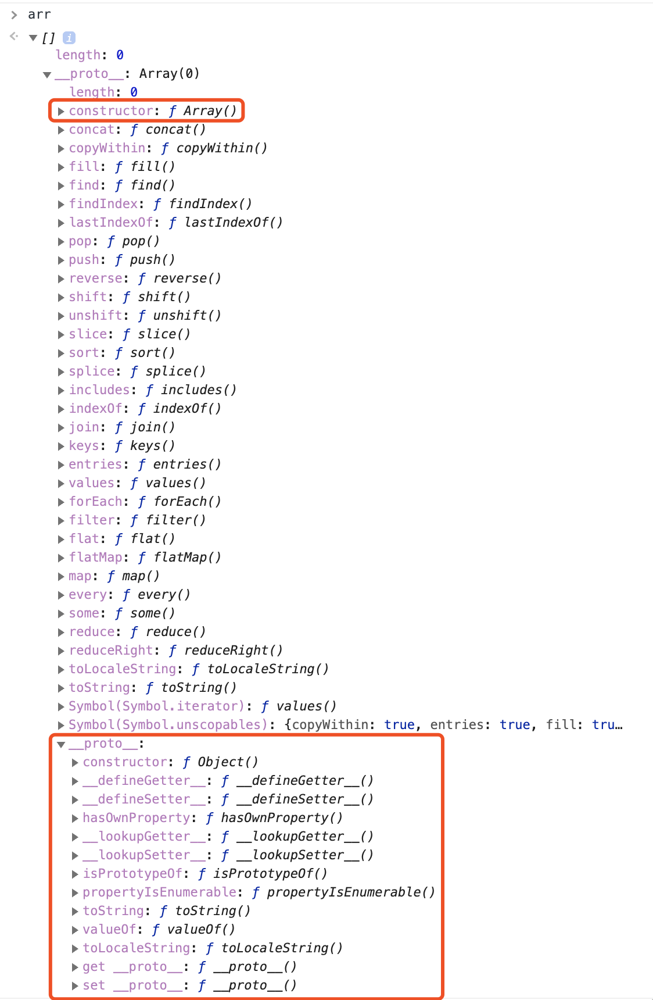
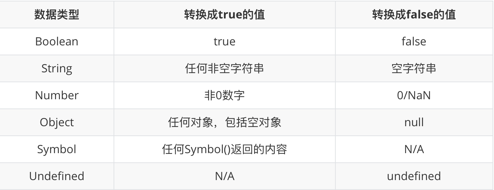
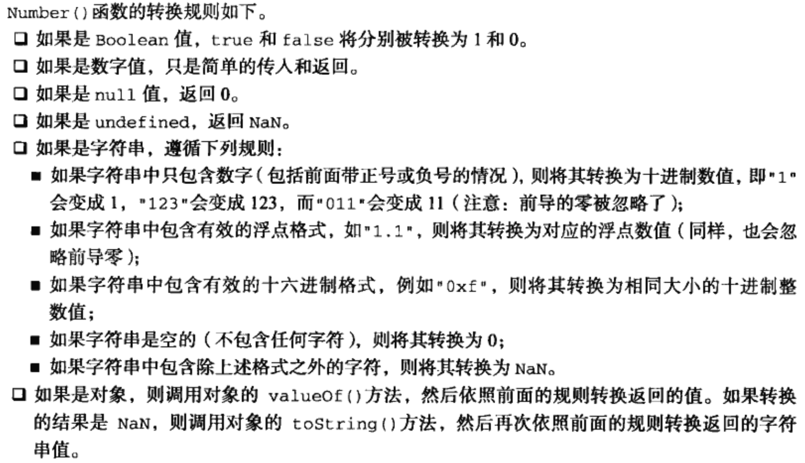

在前端技术飞速发展的今天，似乎所有人都沉浸在前端框架的学习上。在这些框架和新技术推出之后，好像一夜之间就会有《深入解读xx框架》、《手把手教你写一个xx》这样的文章，看得人是眼花缭乱，同时我也在想，为什么有些人不是开发团队的人，但是可以这么快就写出对框架解读的文章？是作弊了吗？显然技术的道路上没有捷径，借用之前在TFC（腾讯前端大会）上听到的React-China的站长说的一句话：“其实我就是学东西快。”然而这句话也不能光从字面意思去理解，大佬之所以学东西快，除了智商碾压的部分，其实是因为大佬的基础知识很牢固。

所以从这篇文章开始，我会根据自己的理解和学习情况，总结JavaScript中一系列常见的重点的知识点（但不会是简单地罗列概念），希望以此建立一个系统的前端知识体系。

而今天就从JavaScript的类型系统开始。

# 有哪些数据类型

我们已经知道，在JavaScript中有七种类型：
- Undefined
- Null
- Boolean
- Number
- String
- Symbol
- Object

前六种是原始类型（primitive），而Object（对象）是引用类型。除此之外，其它所有的类型都是从Object继承的。如果想验证一下的话，可以在控制台声明一个引用类型的变量，然后输出这个变量，可以看到，原型链的最末端都是Object



可以看到，虽然arr是一个数组类型的变量，但是__proto__仍然指向了Object。

# typeof操作符

typeof是我们很熟悉的一种简单检测变量数据类型的操作符。用typeof操作简单类型时，除了Null类型，其它类型都能正确返回对应的类型；对Object和Null类型，都会返回object；而对于函数，则会返回function。

对于typeof不能正确识别Null、引用类型和自定义类型，在我看过的文章里，无不说是设计错误，是JavaScript的历史包袱。没错，不能正确识别Null是因为：

*在 JavaScript 最初的实现中，JavaScript 中的值是由一个表示类型的标签和实际数据值表示的。对象的类型标签是 0。由于 null代表的是空指针（大多数平台下值为 0x00），因此，null 的类型标签是 0，typeof null 也因此返回 "object"。-- From MDN*

但是其不能正确识别引用类型我们是不是可以这样理解：typeof操作符返回的是变量原型链最顶端原型的类型。

当然，在JavaScript的世界里，万物皆对象，如果按照上面的理解，对函数使用typeof操作符应该也返回object，然鹅*函数也确实有一些特殊的属性，因此通过typeof来区分函数和其他对象是有必要的 -- From 《JavaScript高级程序设计》*

# Undefined

Undefined类型只有一个值 -- undefined。在对变量声明（var或let）但未初始化时，这个变量的值是undefined：

```javascript 
var name // undefined
let age // undefined
const gender // Uncaught SyntaxError: Missing initializer in const declaration
```

如果我们不显式地初始化变量，即初始化时就给变量赋值，那么这个时候就会出现一个矛盾：

```javascript
var name
console.log(typeof name) // undefined
​
// age没有声明
// var age
console.log(typeof age) // undefined
```

此时就很难区分变量到底是声明了未赋值还是根本没有声明。因此，从代码规范的角度来看，显式地初始化变量还是很有必要的。这样当typeof返回undefined时，就能清楚地知道是变量还没有被声明，而不是声明了未赋值。

关于undefined还有一个小问题需要注意 -- 因为undefined不是关键字，所以undefined是可以被重写的。我们可以通过以下的代码测试

```javascript
var undefined = 'overwrite undefined'
console.log(undefined)
```

好吧，我承认把你带偏了，如果直接在控制台输入这段代码，输出的仍是undefined，原因是ECMAScript 5中修复了在window下重写undefined的问题，我们可以通过以下代码查看window下的undefined的属性

```javascript
Object.getOwnPropertyDescriptor(window, 'undefined')
​
// { value: undefined, configurable: false, writable: false, enumerable: false }
```

但是不能高兴得太早，我们来看这个例子

```javascript
(function () {
  var undefined = 'overwrite undefined!'
​
  console.log(undefined)
  console.log(undefined === window.undefined)
})()
```

这段代码会分别输出overwrite undefined和false，所以对于之前说的结论应该做一点修改 -- 由于undefined不是关键字，在函数作用域下是可以被重写的，但是window下是不可被重写的

那当我们使用到undefined的时候，如果避免类似的情况发生呢？其实很简单，使用void 0代替即可。

void是JavaScript中的一个操作符，语法是void 表达式，作用是计算后面的表达式并返回undefined，这是一个比直接用undefined更安全的做法。

# Null

Null类型只有一个值，就是null，表示定义了但为空。最开始说到，null表示的是空指针，所以如果定义了变量是准备用来保存对象的话，最好将这个变量初始化为null。这样做不仅可以体现null作为空对象指针的习惯，方便检查变量是否已经有对象引用，同时也更方便地区分null和undefined。

另外，null在JavaScript中是一个关键字，所以不用担心其会被重写。

# Boolean

Boolean类型表示的是逻辑真假值，这个类型有两个值 -- true和false，且为关键字。

对于这两个值其实没有太多需要注意的，不过其它任意的类型的值都可以转换成对应的逻辑值



这些转换规则对于各种流程控制语句中的判断条件是非常重要的。

# Number

在JavaScript中，有2^64 - 2^53 + 3个值，因为NaN占用了9007199254740990，还有-Infinity和Infinity。

同时，JavaScript中可以保存+0和-0，它们俩在值的比较上是相等的，在做加法类的运算时也是相等的，但是在除法的场合就不一样了。当它们分别做分母时，得到的值分别是Infinity和-Infinity。因此，如果想区分+0和-0，最好的方式是检查1/x是Infinity还是-Infinity。

在JavaScript中有效的整数范围是-0xffffffffffffffff 到 0xffffffffffffffff，在这个范围之外的数字无法精确表示。

而最经典的0.1 + 0.2 == 0.3会返回false 的问题，根据浮点数的定义，0.1和0.2的二进制表示分别为

```javascript
Number(0.1).toString(2) // "0.0001100110011001100110011001100110011001100110011001101"
Number(0.2).toString(2) // "0.001100110011001100110011001100110011001100110011001101"
```

因此将二进制下的0.1和0.2相加之后，显然就不等于0.3了。而解决精度丢失的方案有很多，最简洁的其实是比较等号左右的差值的绝对值是不是小于最小精度，即Number.EPSILON

```javascript
console.log(Math.abs(0.1 + 0.2 - 0.3) <= Number.EPSILON)
```

# String

字符串也是平时开发用得很多的一种类型，在JavaScript中，字符串是由16位Unicode字符组成的字符序列，它有最大长度2^53-1，正好是JavaScript中能表示的最大安全整数

```javascript
Number.MAX_SAFE_INTEGER === Math.pow(2, 53) - 1 // true
```

这个值大约有9PB，这个数字是非常大的了，不可能有一个变量要存这么大的数据量，更何况，普通计算机也没有这么大的内存，有也不可能分配这么大的内存给浏览器。

JavaScript字符串把每个UTF16单元当做一个字符来处理，所以处理非BMP的字符（超出U+0000 - U+FFFF）时应格外小心。

# Symbol

Symbol是ES6新增的基本类型，是一切非字符串的对象key的集合，而且ES6规范中的对象系统完全用Symbol重塑了。

Symbol具有字符串描述，但是即使描述相同，Symbol也不相等

```javascript
let s1 = Symbol('symbol')
let s2 = Symbol('symbol')
​
console.log(s1 == s2) // false
```

几个需要注意的点：

- 使用new运算符的语法会报TypeError
- Symbol在for...in迭代中不可枚举。Object.getOwnPropertyNames()不会返回Symbol对象为key的属性，但是可以通过Object.getOwnPropertySymbols()获取
- 使用JSON.stringify()时，会忽略Symbol值作为key的属性
- 当使用Symbol值作为key时，这个key会被Object再包装一次

```javascript
var a = {}
var k = Symbol('a')
​
a[k] = 1
console.log(a[k]) // 1
console.log(a[Object(k)]) // 1
```

# Object

在JavaScript的世界中，所有内容都是对象。关于对象的基础知识就不再赘述，这里解答一个问题：为什么给对象添加的方法能用在基本类型上？

```javascript
Number.prototype.test = () => console.log('test')
​
var num = 1
​
num.test() // test
```

首先，几个基本类型在对象类型中都有对应的“映射”：

- Number
- String
- Boolean
- Symbol

前三种可以使用new操作符，返回一个对应类型的实例。虽然对Symbol函数使用new操作符会报错，但Symbol函数仍然是一个构造器。这四种基本类型在被转换成对应的对象类型后，就可以通过原型链访问到对应的类型的原型。而上述代码的最后一行中，. 操作符其实就是会临时对num进行一次装箱操作，将其转换成Number对象类型，这样就使得我们看上去能在基础类型上调用对应对象的方法。

# 类型转换

众所周知，JavaScript作为动态语言，最大的特点之一就是变量的类型是可以任意转换的，而且我们熟悉的运算几乎都会先进行类型转换。


上图中大部分的转换是很符合我们的直觉的，比较复杂的Number和String之间的转换，以及对象和基本类型之间的转换。

## StringToNumber

将字符串转换成数字有三个函数：

- Number
- parseInt
- parseFloat

Number接受一个参数，并且按照一定的规则判断参数是否可以被转换成数字。



从图中就能看出Number函数在内部做了很多判断和操作。

parseInt接受两个参数，第一个参数是要转换的内容，第二个参数是转换的进制。在不传入第二个参数的情况下，parseInt只支持16进制前缀‘0x’，而且会忽略第一个非16进制字符及其后的内容；如果是0开头的数字，会因为不同的浏览器而使用不同的进制，因此所有情况下使用parseInt都应该指定进制。

这两个函数共同的问题都是不支持科学计数法。

有趣的是，Nicholas Zakas在《JavaScript高级程序设计》中说因为Number的判断条件的复杂性，因此在处理整数时更常用的是parseInt。但是winter在重学前端中给出的建议是，多数情况下，Number是比parseInt和parseFloat更好的选择。

那对于普通开发者而言，应该使用Number还是parseInt&parseFloat呢？我还是觉得一切不基于业务场景和开发者自身情况的技术选型都是耍流氓

BTW，如果平时只处理

- 二进制、八进制、十六进制到十进制的转换
- 字符串数字到数字的转换
- 科学计数法到数字的转换

可以使用加号操作符进行类型的隐式转换
```javascript
var a = '99' // 字符串数字
var b = '0b111' // 二进制
var c = '0o123' // 八进制
var d = '0xFF' // 十六进制
var e = '1e3' // 科学计数法
​
console.log(+a) // 99
console.log(+b) // 7
console.log(+c) // 83
console.log(+d) // 255
console.log(+e) // 1000
```

## 装箱转换

装箱转换，即，将每一中基本类型转换为对应的对象。

虽然Symbol函数无法用new来调用，但是可以用Object函数显式调用装箱转换

```javascript
var symbolObject = Object(Symbol("a"));
​
console.log(typeof symbolObject); //object
console.log(symbolObject instanceof Symbol); //true
console.log(symbolObject.constructor == Symbol); //true
```

所有被装箱的对象都有私有的Class属性，这个属性的值可以通过Object.prototype.toString获取

```javascript
var a = Object(Symbol('a'))
​
console.log(Object.prototype.toString.call(a)) // [object Symbol]
```

在JavaScript中，开发者是不能更改这个私有的Class属性的，因此Object.prototype.toString可以更加准确识别对象对应的基本类型，它比instanceof更准确。

## 拆箱转换

在JavaScript中，规定了ToPrimitive函数，它是对象类型到基本类型的转换，即，拆箱转换。

拆箱转换会尝试调用valueOf和toString来获取拆箱后的基本类型。如果两者都不存在，或者都没有返回基本类型，则会产生类型错误TypeError。

对象到数字的转换优先调用valueOf，再调用toString

```javascript
var o = {
    valueOf : () => {console.log("valueOf"); return {}},
    toString : () => {console.log("toString"); return {}}
}
​
o * 2
// valueOf
// toString
// TypeError
```

而对象到字符串的转换优先调用toString，再调用valueOf

```javascript
var o = {
    valueOf : () => {console.log("valueOf"); return {}},
    toString : () => {console.log("toString"); return {}}
}
​
String(o)
// toString
// valueOf
// TypeError
```

而在ES6之后，还允许对象通过显式指定toPrimitive Symbol来覆盖原有的行为

```javascript
var o = {
    valueOf : () => {console.log("valueOf"); return {}},
    toString : () => {console.log("toString"); return {}}
}
​
o[Symbol.toPrimitive] = () => {console.log("toPrimitive"); return "hello"}
​
console.log(o + "")
// toPrimitive
// hello
```

# 小结

文章里讲到的一些内容并没有更加深入地探讨，主要是因为对应的主题会在之后的文章中再展开，而且一个主题也会花费大量的时间重新读官方文档和其它文章，所以今天的这个主题也算是一次试水吧。

本文的参考资料主要是：

- 重学前端 - winter
- JavaScript高级程序设计
- https://www.cnblogs.com/qcloud1001/p/10178391.html
- https://blog.csdn.net/javaiswhat/article/details/51464604?utm_source=blogxgwz2
- https://segmentfault.com/a/1190000007015757
- 以及MDN的文档

# 后记

在经过从wordpress，到Express+Mongo，再到Koa+MySQL+Vue的博客搭建，我花费了大量的时间在简单的CRUD和网站的样式上，从而忽略了文章的细节。在年初把博客服务关闭之后，一直在想到底应该再以哪种形式对自己的学习做好输出呢？最终还是回归了公众号（半年前手残把之前可以留言的公众号注销了、Github和知乎。

之前的几篇"文章"内容比较水，没什么技术含量，主要是为了先发几篇凑个数，从这一篇开始，我会尽量做到周更，同时保证内容不再太水，毕竟看文章的都是大佬，而能看到这里可能也是为了支持一下文章的完整阅读率吧。

欢迎关注公众号：Debugger


